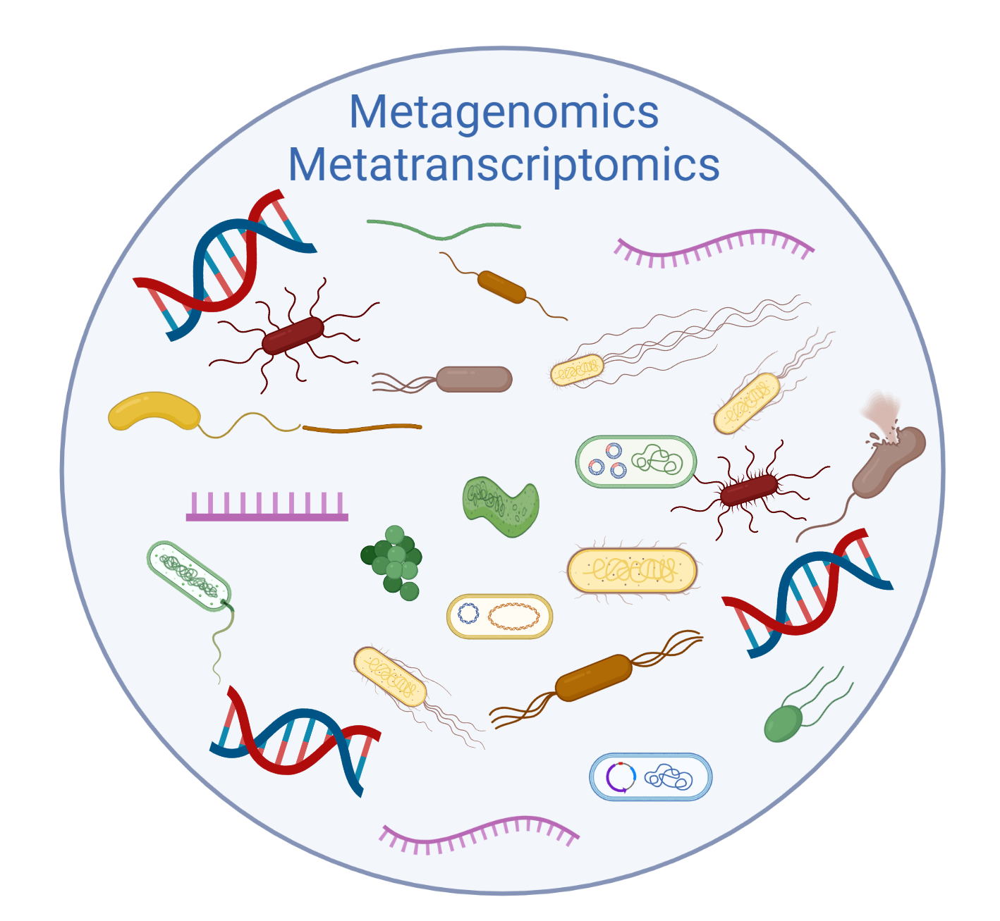
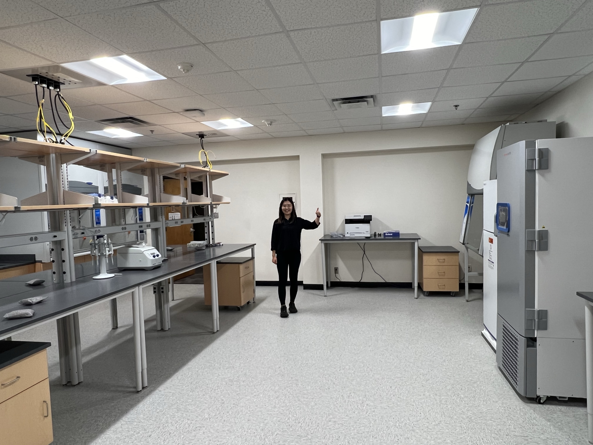
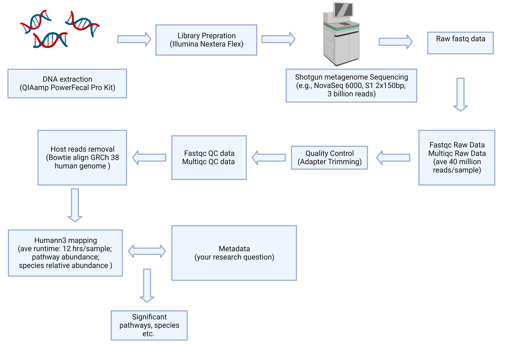

## My lab at UT Arlington provides end-to-end microbiome sequencing consultation and collaboration.

* My molecular biology wet laboratory has completed construction and is now accepting sample BioBank and end-to-end microbiome service. 
* I am happy to be a Co-I of your R01s and provide high quality microbiome multi-omics service. 

## Introduction
* Microbiome sequencing price has dropped substantially. More researchers and companies are interested in learning about microbiome in humans, environment, and animals. Shotgun sequencing has enabled in-depth learning of microbial community structure, pathway, functional potential, and active functions. One answer we ALL want to know about microbiome: Who is there, what are they doing? 
* Shotgun data is easier to obtain now than before with high throughput sequencing platforms like Illumina NovaSeq6000. However, it is challenging to analyze the data for researchers who don't have coding experience. First, the data generated from shotgun sequencing is huge, usually ranging from 3G to 20G, more than 40 million reads per sample for shotgun metagenome. Shotgun metatreanscriptome is even more challenging, with more than 20G and 150 million reads per sample. The mid-files generated in computation multiply output size. It's easy to have 100 samples metagenome take 4T of storage space, and 160 samples metatranscriptome take 30T of storage space (including intermediate files). Second, because of large data, computation time can exponentially increase. For example, shotgun metagenome assembly and mapping can take up to 20 hours per sample. Shotgun metatranscriptome rRNA, adapter, human genome, and human transcriptome removal take an average of 90 hours of computation time. The computation also consumes large memory(100G). Third, data processing is time-consuming and requires access to supercomputing clusters. Finally, data processing also involves proficient use of python and unix in Linux system.

## Example conceptuals
Shotgun metagenome sequencing workflow example conceptual

Shotgun metatranscriptome sequencing workflow example conceptual

### Notes:
* I often see people using human databases for environmental samples in shotgun metagenomic sequencing. It is not wrong, but you are only mapping up to 20% of your environmental sample reads into the human database. Analyze shotgun metagenomic sequencing for environmental samples are more challenging. I recommend the researchers identify the goal of the research and use assembly based approaches. 
* rRNA in shotgun metatranscriptome sequencing are extremely difficult to experimentally remove, I recommend the researchers to sequence deep to obtain more effective reads. See my [blog post](https://github.com/YikeShen/metatranscriptome_rRNALibPrep_test). 
* Please do not discard your valuable stool RNA sample if RIN is low, a manuscript describing the RNA quality and shotgun metatranscriptome sequencing is in prepration. 

### Type of Microbiome Sequencing

| Sequencing         | Typical steps                                                             |
| --------         | ------------------------------------------------------------ |
| Shotgun metagenome| QC, host removal(if needed), mapping or assembly, species and pathway profiling, and more |
| Shotgun metatranscriptome| QC, rRNA removal, host removal (if needed) mapping or assembly, gene expression and functional pathway profiling, and more |
| Amplicon sequencing| QC, OTU table, alpha and beta diversity, community structure|

I am happy to collaborate with your microbiome projects. I can offer my insights on what computation resources you need and help you process the data with potential options. Please email me for collaborations.

Graphics created with BioRender.com. Copy right: Yike Shen

Updated 10/06/24
