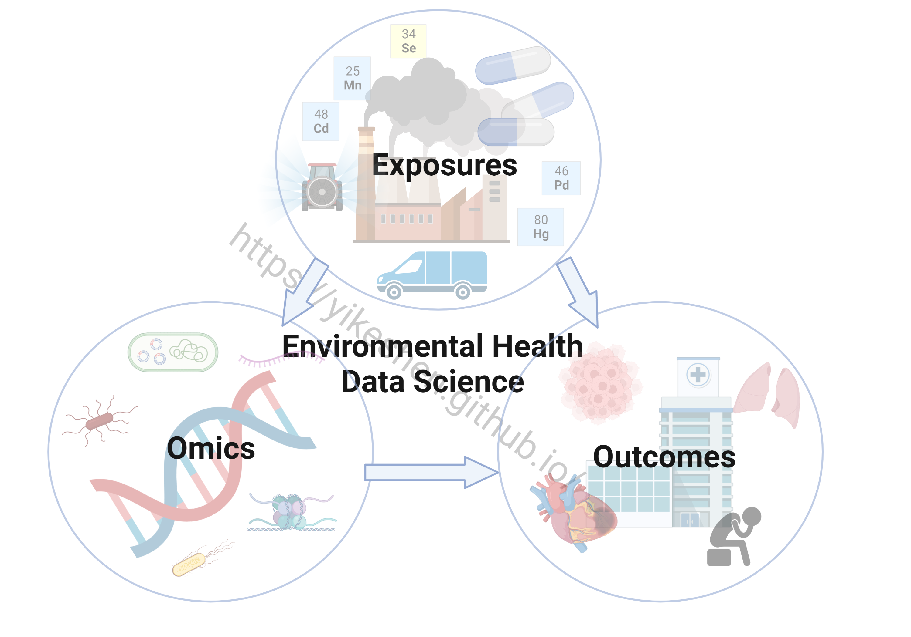
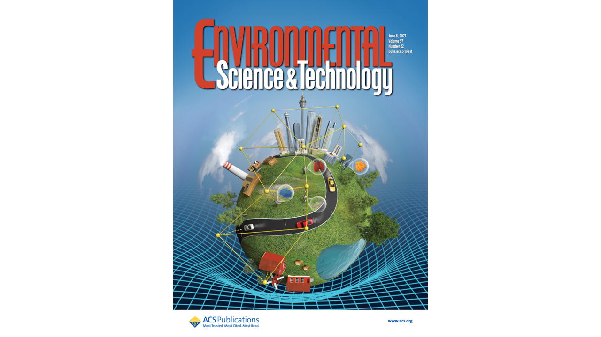

The Shen Laboratory focuses on Environmental Health Data Science where we integrate environmental exposures, multi-omics, and health outcomes. We approach this framework through computational precision environmental health and biomarker discovery from high dimensional omics and environmental exposure data.

[Dr. Shen UTA Faculty profile](https://www.uta.edu/academics/faculty/profile?username=sheny4)\
[Dr. Shen CV](https://github.com/YikeShen/Shen-Yike_CV/blob/master/CV_Shen%2CYike_120923.pdf)

## News

September 2023, Dr. Shen recevied The University of Texas System Rising STARs award, a $100,000 competitive internal funding to help build #ShenLab. 

September 2023, The Shen Laboratory opens at the Department of Earth and Environmental Sciences, University of Texas at Arlington

May 2023, Our Cohort Network paper was published as Cover at Environmental Science & Technology! [Read](https://pubs.acs.org/doi/abs/10.1021/acs.est.2c08174)

Feature article\
Shen Y. (2022). Harnessing high-dimensional data in environmental health sciences. Research Features. DOI: 10.26904/RF-144-3452044615. [Feature article link](https://researchfeatures.com/wp-content/uploads/2022/11/Yike-Shen.pdf)

Interview\
Women in Science: we have the power to change the world. Episode 6 – Yike Shen. UCLA GradSWE interview series hosted by Yifan Gao. December 22, 2022. [Interview link](https://www.youtube.com/watch?v=W0Nmf7P1KAM&ab_channel=GradSWEUCLA)

## Resources
We support open and transparent research, all code for our publications (leading and/or corresponding authors) are available at our [GitHub Repository](https://github.com/YikeShen?tab=repositories); \
list of our [publications](https://scholar.google.com/citations?hl=en&user=hLvLhVcAAAAJ&view_op=list_works&sortby=pubdate);\
list of Dr. Shen's [talks](https://yikeshen.github.io//talks/)

## Contact Information
Yike Shen, Ph.D. \
Assistant Professor \
Department of Earth and Environmental Sciences \
University of Texas at Arlington \
500 Yates Street, Room 217 \
Arlington, Texas 76019\
Email: [yike.shen@uta.edu](yike.shen@uta.edu)

#### Please forward your emails to my UTA email address. My Columbia email address is now deactivated. 
Updated 11/10/2023

