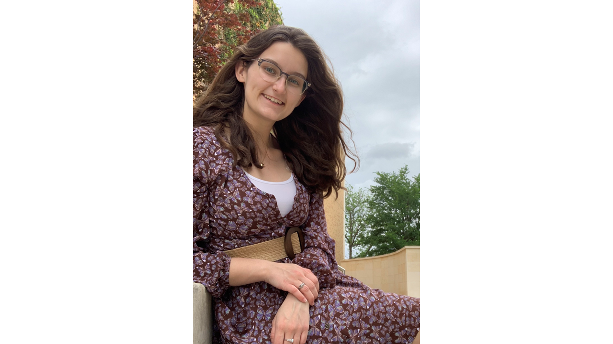
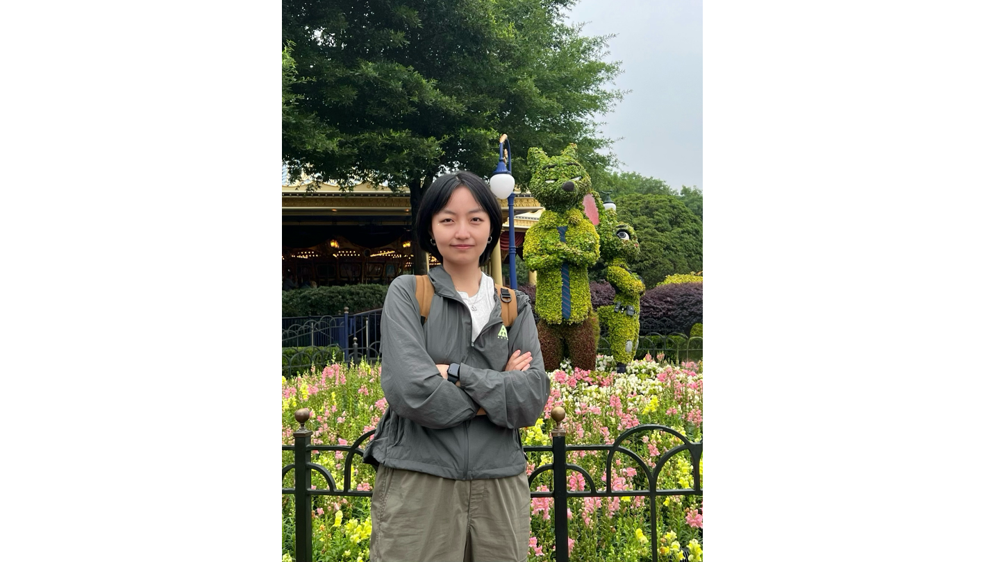

### Yike Shen, Ph.D.
Assistant Professor \
Department of Earth and Environmental Sciences \
University of Texas at Arlington \
Email: yike.shen@uta.edu \
my [CV](https://github.com/YikeShen/Shen-Yike_CV/blob/master/CV_Shen%2CYike_062024.pdf) 

Training: 
* Postdoctoral Research Scientist, Department of Environmental Health Sciences, Columbia University in the City of New York, 06/2020-08/2023
* Ph.D. Crop and Soil Science – Environmental Toxicology, Michigan State University, 2020
* Ph.D. dual major, Environmental Science and Policy, Michigan State University, 2020
* B.Sc. Environmental and Conservation Sciences, University of Alberta, 2016

## Students

### Katherine Atkins
May 2024-present
- Undergraduate student at UTA, Environmental Science Major with Data Science Minor

### Dhruvilkumar Ashokbhai Chodvadiya
May 2024-present
- Master student at UTA, Computer Science and Engineering Major

### Aaron Kuang
May 2024-present
- High school student, Greenhill High School

### Yidan Zhang
August 2024 (expected)
- Ph.D. student
- MS in Epidemiology and Health Statistics at Sun Yat-sen University (China), BS in Public Health at Shanxi Medical University (China).

### Steve Adjorlolo
August 2024 (expected)
- Ph.D. student
- MEng in Petroleum Engineering at University of Calgary (Canada), B.Eng. in Petroleum Engineering at China University of Petroleum (China)

### You?
Please see Join tab for details. 

## Lab Alumni
### Boris Minasenko
January 2023-September 2023
- Master of Science in Toxicology, Columbia University, New York, NY
- Next position: Bioinformatics Analyst at Emory University Rollins School of Public Health
- MS thesis: Deep Autoencoders as Dimensional Reduction and Prediction Tools in Cancer Type Identification. (manuscript in prepration)

### Xingyu Zhang
March 2023-November 2023 
- Master of Public Health in Environmental Health Sciences, Columbia University, New York, NY 
- MPH project: Associations of childhood hair metal exposures with intestinal microbiota multi-omics in a Canadian Gestation Cohort. (manuscript in prepration)

Updated 05/23/2024

