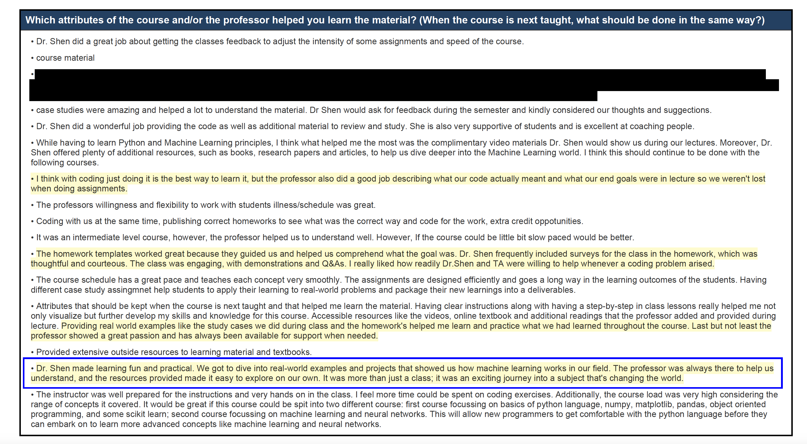
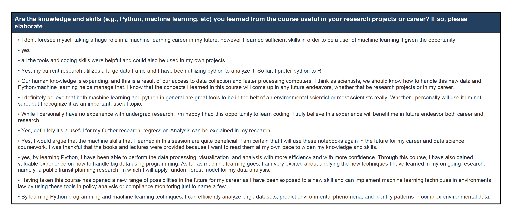
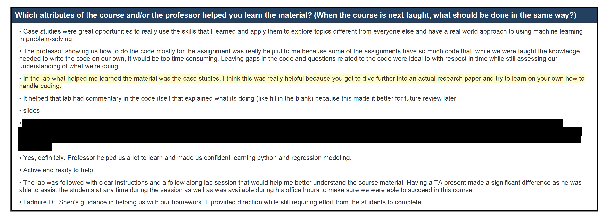
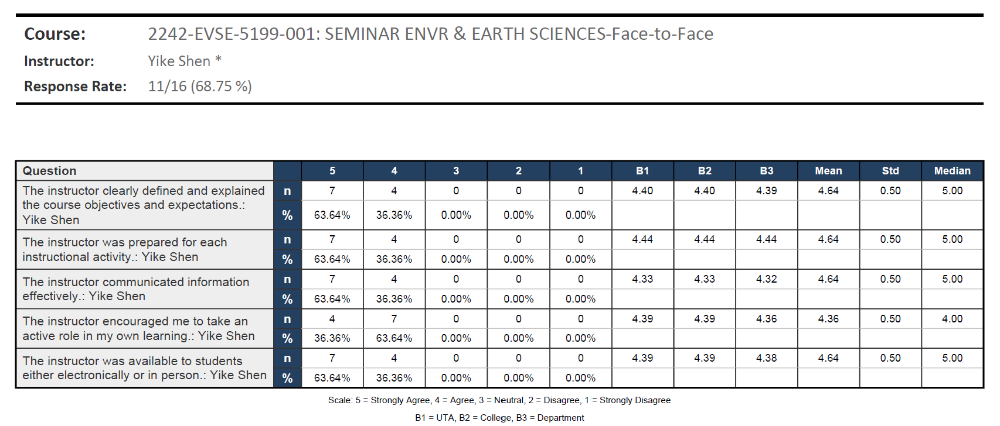

My philosophy as an instructor is to create a classroom environment that enables students from all backgrounds to learn and develop their full potential toward their chosen careers. I believe teaching/mentoring and research are equally important responsibilities of a professor to help students learn, think, and succeed. To accomplish this goal, I thrive to build an engaging and welcoming lab and classroom through various active learning activities. 

### Spring 24: ENVR/GEOL 4458, EVSE 5458: Machine Learning for Earth and Environmental Scientist 
[Syllabus](https://oit-ead-canvas-syllabus.s3.amazonaws.com/uta.instructure.com/2024-SPRING/175941-2242-ENVR-4458-001/2024-SPRING_2242-ENVR-4458-001.pdf)\
The goal of the machine learning class is to equip students with critical skills in the Python programming language and Machine Learning algorithms, and to apply these skills to various problems related to their interest. The case studies for this class focuses on Environmental Science, but the skills are transferrable to all other domains. 
Section 001-Lecture

Student feedback - Lecture section

Student feedback on question "Are the knowledge and skills you learned from this course useful in your research projects or career"

Section 011-Lab

Student feedback - Lab section

### Spring 24: ENVR 4199/EVSE 5199/GEOL 4199/GEOL 5199, section 001, Seminar in Environmental and Earth Sciences
[Syllabus](https://oit-ead-canvas-syllabus.s3.amazonaws.com/uta.instructure.com/2024-SPRING/181879-2242-ENVR-4199-001/2024-SPRING_2242-ENVR-4199-001.pdf)\

### Fall 23: ENVR 4199/EVSE 5199/GEOL 4199/GEOL 5199, section 001, Seminar in Environmental and Earth Sciences 
[Syllabus](https://oit-ead-canvas-syllabus.s3.amazonaws.com/uta.instructure.com/2023-FALL/157227-2238-EVSE-5199-001/2023-FALL_2238-EVSE-5199-001.pdf) \
The goal of the seminar class is to teach students to get key information from speakers and write a structured summary: 
1. Why? Big picture
2. What? Knowledge gap or barrier
3. How? General ways the speaker fill this gap and its importance.
4. Who? The speaker’s tools and expertise to fill this gap, their results.
5. So What? Outcome and how did the speaker advance the understanding.\
Student course evaluation:

Fall 24: ENVR 4455: Environmental Modelling
